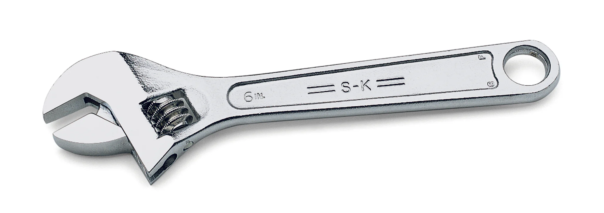
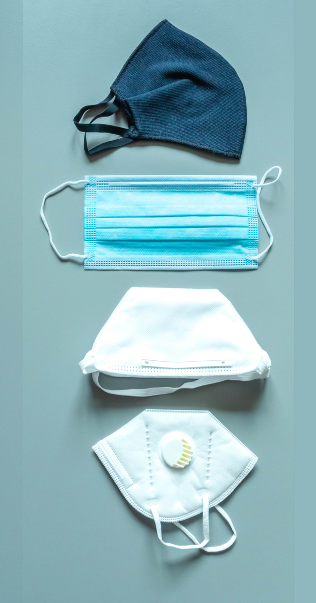
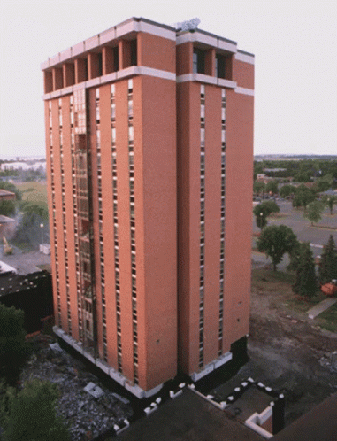
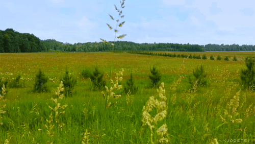
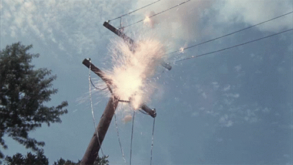

# Bilan technique de l'asso

Présenté par Célestine 😺 & Jérôme 🤘

## Bilan général sur les années écoulées

2 personnes sur l'administration c'est trop peu pour des personnes actives 😓

Merci à **Guillaume** ❤️ pour les coups de main

**2018-2025** : 7 ans sans évolution majeure 🕸️🕷️

## Faits marquants

### 2019-2020

- Problèmes financement 💸 avec la bricoleuse
- perte du DataCenter la Bricoleuse 🔥

### 2020-2022

- Période Covid 
- **grosse utilisation** de l'etherpad et de la visioconférence

### Fin 2022

- perte de **dc4data Limonest**
- Perte sèche
- des vidéos ... 🎥
- des visioconférences ... 🧑🏻‍💻🧑🏾‍💻👩‍💻
- du lufi ... 📄
- entre autres ...

### 2023

- Mise en jachère pure 🧑🏻‍🌾🪴
- très peu d'évolution 🕸️🕷️
- Déconnection pendant un mois et demi ⛔
- perte de serveurs 🪫
- déconnection à répétition ❌❗
- espace-temps contraint pour les 2 admins 😓

### Été 2024

- Grand nettoyage de printemps 🧽🧹🫧
- validation des serveurs restants ✅
- remise en place de services ➕
- réaménagement des services sur les serveurs 🔧
- Création de nouveaux serveurs 🔌

### Novembre 2024

- Problème onduleur : déconnexions intempestives 📛
- Achat de nouvelles batteries 🔋
- Ajout de la supervision via Nagios 🕵🏻‍♂️

### Hiver 2024

- Grosse panne réseau ovh
- environ 2 semaines de coupures

### Printemps 2025

- ENFIN !
- ***La FIIIIBRE*** ! 🥳
- Chez **ILLYSE** !
- Plus de problèmes **IPv6**,
- plus de **déconnexions**,
- plus de **SAV OVH** !!!!!!! 🥰

### Été 2025

- démarrage des nouveaux serveurs
- pas encore utilisés

## Objectifs

On ne va pas s'arrêter là !

### automne 2025

- Mise en production des nouveaux serveurs
- bastion SSH
- Reverse Proxy
- démarrage des process
  - automatisation
  - industrialisation

### Plus tard d'ici la fin de l'année

- mise à niveau DNS, LDAP
- mise à jour des services essentiels : mails, mailings listes, site web, etherpad
- Retour des services
  - stockage cloud
  - lufi
  - **Visioconférence**

## Conclusion

Si vous êtes intéressé

Viendez ...

---

> *on a des cookies* !
>
> 😋

## Questions ?
<!-- footer: ''-->

